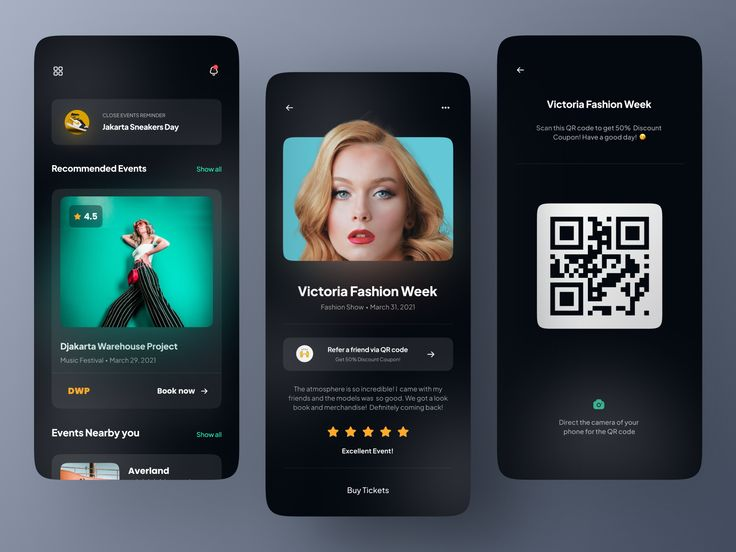
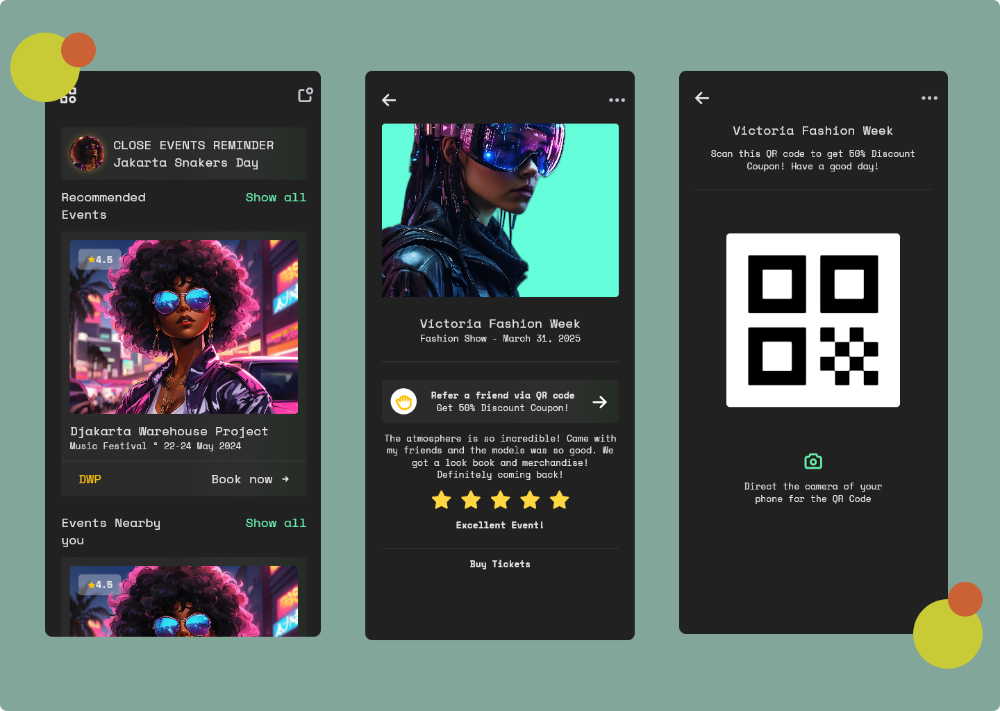

### English
***
**Project/Concept Name:** Flutter Just For Fun. This is a concept where I will publish Flutter code for UIs that I find beautiful.

**Application Name:** Event App

**To clone the git project:** [Flutter Just For Fun Repository](https://github.com/BaHithBENON/Flutter-Just-For-Fun-01.git)

**Inspiration Design:** [Event App Concept](https://dribbble.com/shots/15391237-Event-App-Concept?utm_source=Clipboard_Shot&utm_campaign=risangkuncoro&utm_content=Event%20App%20Concept&utm_medium=Social_Share)

**Result of the remake**

**NB :** Everyone can clone the project or modify it on other branches.

***
### Française 
***
**Nom du projet/concept :** Flutter Just For Fun. Ceci est un concept dans lequel je publierai du code Flutter pour des interfaces utilisateur que je trouverai beaux.

**Nom de l'application :** Event App

**Pour cloner le projet git :** [Flutter Just For Fun Repository](https://github.com/BaHithBENON/Flutter-Just-For-Fun-01.git)

**Design d'inspiration :** [Concept de l'application d'événement](https://dribbble.com/shots/15391237-Event-App-Concept?utm_source=Clipboard_Shot&utm_campaign=risangkuncoro&utm_content=Event%20App%20Concept&utm_medium=Social_Share)

**Result of the remake**

**NB :** Tout le monde peut cloner le projet ou le modifier sur d'autres branches.